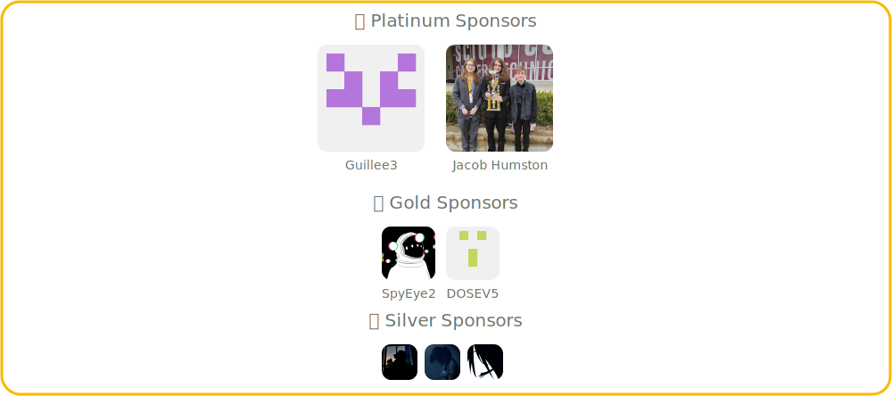

 
<b>The most advanced self-hosted ticket bot for Discord</b> 
Related Projects: 
  
<a href="https://discord.com/invite/26vT9wt3n3"></img></a>
<a href="https://github.com/open-discord-bots/open-ticket/releases/tag/v4.2.0"></img></a>
<a href="https://otdocs.dj-dj.be"></img></a>
<a href="https://github.com/open-discord-bots/open-ticket/blob/main/LICENSE"></img></a>
<a href="https://otdocs.dj-dj.be"></img></a>
<a href="https://github.com/sponsors/DJj123dj"></img></a>
<a href="https://hub.docker.com/repository/docker/djj123dj/open-ticket"></img></a>
<a href=".github/pterodactyl-eggs/README.md"></img></a>

Open Ticket is the most <b>advanced and customizable</b> Discord ticket bot available right now. It features more than <b>350+ configurable settings</b> to control almost every aspect of your ticket system.
From <code>HTML transcripts</code> and <code>Advanced Plugins</code> to <code>Claiming & Pinning</code>, <code>Modal Questions & Limits</code>, <code>Detailed Statistics</code>, and much more.
The bot is fully translated into <b>38+ languages</b> and has been battle-tested in large Discord servers. Need help or want to get involved? Feel free to join our <a href="https://discord.dj-dj.be"><b>Discord server</b></a>.

<h3 align="center"><b>⭐️ Support Open Ticket’s growth by starring this repo! ⭐️</b></h3>

❤️ Love Open Ticket? <a href="https://github.com/sponsors/DJj123dj">Sponsorships</a> help fuel our HTML transcript servers and future features! ❤️ 

---
> **[-> Navigate to (⏱️ Quick Setup)](#️-quick-start)**  
> **[-> Navigate to (📚 Documentation)](https://otdocs.dj-dj.be)**  
> **[-> Navigate to (📞 Support Server)](https://discord.dj-dj.be)**  
> **[-> Navigate to (🧩 Plugins/Addons)](https://odplugins.dj-dj.be)**  
> **[-> Navigate to (🦇 Pterodactyl Eggs)](.github/pterodactyl-eggs/README.md)**  

### 📌 Features
#### Core Features
- </img> **Ticket Management** - Close, reopen, delete, claim or pin tickets with ease.
- </img> **Powerful Commands** - Manage your support system with **30+ commands** for staff & users.
- </img> **Modal Questions** - Ask users **custom questions** before a ticket is created.
- </img> **Priorities** - Assign **priority levels** to tickets to highlight urgent requests.
- </img> **Participants** - Add or remove participants & transfer ownership from one user to another.
- </img> **Adjustments** - Rename tickets, change ticket types or transfer ownership.
- </img> **Blacklist & Limits** - Prevent users from creating tickets and set per-user or global ticket limits.
- </img> **Highly Customisable** - Configure **350+ settings** covering appearance and behaviour.

#### Ticket Automation & Workflows
- </img> **Unlimited Possibilities** - Create unlimited tickets, panels & question flows.
- </img> **Autoclose Tickets** - Automatically **close tickets** after predefined conditions.
- </img> **Autodelete Tickets** - Automatically **delete closed tickets** to keep channels clean.
- </img> **Category Routing** - Move tickets between categories based on claim or close state.

#### Transcripts & Insights
- </img> **HTML Transcripts** - Generate beautiful, easy-to-read **HTML transcripts** for every ticket.
- </img> **Detailed Statistics** - Track **50+ statistics** for tickets, users and server activity.
- </img> **Ticket Logs** - Track **all ticket events** such as creation, closures, and staff actions.

#### User Experience
- </img> **Fully Translated** - Available in **38+ languages**, translated and maintained by the community.
- </img> **Modern Interactions** - Full support for buttons, dropdowns, slash/text commands & modals.
- </img> **Panels** - Create messages with buttons or a dropdown for users to open tickets.
- </img> **Sub-Panels** - One panel not enough? Use multiple panels to offer more choices.

#### Plugins & Ecosystem
- </img> **Plugin System** - Use custom plugins to **add new features** or **modify existing behavior** of the bot.
- </img> **Community Plugins** - Use and share plugins built by the community.
- </img> **Advanced API** - Build advanced plugins with access to ticket events and internal systems.
- </img> **Integrations** - Connect Open Ticket with external services to automate workflows across platforms.
- </img> **Bonus Features** - Somehow, we included Reaction Roles and URL Button support as well.

#### Deployment
- </img> **Quick Setup** - Easy **5-minute configuration** using the Interactive Setup CLI.
- </img> **Scalable & Reliable** - Battle-tested in servers with **100k+ members**.
- </img> **Private & Secure** - Used by thousands of servers with respect for security & privacy.
- </img> **Pterodactyl Support** - 100% compatible with Pterodactyl panels. [(Download official eggs)](.eggs/README.md)
- </img> **Docker Support** - Deploy Open Ticket in minutes with Docker containers.

#### Extend functionality even more with our [pre-made community plugins](#-plugins)!
> - </img> **Reviews** - Create and manage a support review system for tickets.
> - </img> **Tags** - Define keywords that automatically trigger predefined responses.
> - </img> **Reminders** - Create and manage custom reminders for users or staff.
> - </img> **AI Integrations** - Connect to AI providers such as ChatGPT, Claude, or Gemini.
> - </img> **Channel Display** - Create voice channels that display real-time ticket system statistics.
> - </img> **Forms** - Build advanced forms for collecting structured information from users.
> - </img> **Custom Embeds** - Create and send custom embeds via commands.
> - </img> **Customization Tools** - Additional configuration options for advanced behavior and styling.
> - </img> **Web Dashboard** - Configure and manage the bot through a remote web dashboard.
> - </img> **Feedback** - Collect user feedback after ticket deletion using forms.
> - </img> **SQLite Database** - Use an SQLite backend for improved performance and lightweight storage.
> - </img> **And more** - Additional community plugins are available and actively expanding.

## ⏱️ Quick Start
> 1. Download the [latest version of Open Ticket](https://github.com/open-discord-bots/open-ticket/releases/latest).
> 2. Make sure you have installed Node.js on your system (check using `node -v`, minimum `v20`).
> 3. Install any required dependencies using `npm install`.
> 4. Configure the bot in one of the following ways:
>    - Method 1 (Easy): Start the **Quick Setup CLI** using `npm run setup`.
>    - Method 2 (Hard): Manual **JSON configuration** in `./config/...`
> 5. If using the **Quick Setup CLI**, click on `> ⏱️ Quick Setup` and follow the instructions.
> 6. Start the bot using `npm start` or `node index.js`
>    - If any config errors occur, the bot will give you a report of how to solve them.
>    - Follow the instructions and restart the bot.
> 7. Enjoy using Open Ticket!
> 8. Install plugins from the [**Official Plugin Repository**](https://github.com/open-discord-bots/plugins)
>
> #### 🚦 Next Steps
> **[-> Navigate to (📚 Documentation)](https://otdocs.dj-dj.be)**  
> **[-> Navigate to (📞 Support Server)](https://discord.dj-dj.be)**  
> **[-> Navigate to (🧩 Plugins/Addons)](https://odplugins.dj-dj.be)**  
> **[-> Navigate to (🦇 Pterodactyl Eggs)](.github/pterodactyl-eggs/README.md)**  
>
> #### 🖥️ Recommended Hosting
> - **A VPS (Virtual Private Server)** - Extra customisation & more stability. Recommended for most servers.
> - **Any Pterodactyl-Based Panel** - Easy installation & configuration.

## 📸 Previews

## 💬 Translations
With the amazing support of our translators, we've been able to translate Open Ticket in more than **38 languages**!
#### Categories: 🟢 Available - 🤖 Partially Made Using AI - 🟠 Incomplete - 🔴 Unavailable/Outdated

|🔍  |Languages (38)        |Config Value            |Maintainers (Github/Discord)    |
|----|----------------------|------------------------|--------------------------------|
|🟢   |🇬🇧 English            |`"english"`             |djj123dj                       |
|🟢   |🇳🇱 Dutch              |`"dutch"`               |djj123dj                       |
|🟢   |🇩🇪 German             |`"german"`              |benzorich                      |
|🟢   |🇫🇷 French             |`"french"`              |guillee.3                      |
|🟢   |🇪🇸 Spanish            |`"spanish"`             |Reddishye & josuens            |
|🟢   |🇵🇹 Portuguese         |`"portuguese"`          |quiradon                       |
|🟢   |🇮🇹 Italian            |`"italian"`             |fraden1mvp. & imperatorix_17   |
|🟢   |🇸🇪 Swedish            |`"swedish"`             |NoOneNook                      |
|🟢   |🇳🇴 Norwegian          |`"norwegian"`           |NoOneNook                      |
|🟢   |🇹🇭 Thai               |`"thai"`                |modshd                         |
|🟢   |🇮🇳 Hindi              |`"hindi"`               |challenger_nova                |
|🟢   |🇭🇺 Hungarian          |`"hungarian"`           |kornel0706                     |
|🟢   |🇮🇩 Indonesian         |`"indonesian"`          |erxg                           |
|🟢   |🇱🇹 Lithuanian         |`"lithuanian"`          |tsgindrius                     |
|🟢   |🇺🇦 Ukrainian          |`"ukrainian"`           |anderskiy                      |
|🟢   |🇨🇿 Czech              |`"czech"`               |spyeye_                        |
|🟢   |🇷🇴 Romanian           |`"romanian"`            |sankedev                       |
|🟢   |🇩🇰 Danish             |`"danish"`              |the_gamer                      |
|🟢   |🇹🇷 Turkish            |`"turkish"`             |palestinian                    |
|🟢   |🇦🇪 Arabic             |`"arabic"`              |palestinian                    |
|🟢   |🇵🇱 Polish             |`"polish"`              |danoglez                       |
|🟢   |🇮🇷 Persian            |`"persian"`             |dysashop & zhavis              |
|🟢   |🇧🇩 Bengali            |`"bengali"`             |HanumeshGupta                  |
|🟢   |❓ Catalan            |`"catalan"`             |guillee3                       |
|🟢   |🇨🇳 Traditional Chinese|`"traditional-chinese"` |me.october                     |
|🟢   |🇰🇭 Khmer (Cambodia)   |`"khmer"`               |yuuslokrobjakkroval            |
|🤖   |🇪🇪 Estonian           |`"estonian"`            |iamnotmega                     |
|🤖   |🇫🇮 Finnish            |`"finnish"`             |iamnotmega                     |
|🤖   |🇯🇵 Japanese           |`"japanese"`            |HanumeshGupta                  |
|🤖   |🇬🇷 Greek              |`"greek"`               |HanumeshGupta                  |
|🤖   |🇸🇮 Slovenian          |`"slovenian"`           |HanumeshGupta                  |
|🤖   |🇰🇷 Korean             |`"korean"`              |HanumeshGupta                  |
|🤖   |🇮🇳 Tamil              |`"tamil"`               |HanumeshGupta                  |
|🤖   |❓ Kurdish            |`"kurdish"`             |HanumeshGupta                  |
|🤖   |🇷🇺 Russian            |`"russian"`             |NoOneNook                      |
|🤖   |🇱🇻 Latvian            |`"latvian"`             |NoOneNook                      |
|🤖   |🇻🇳 Vietnamese         |`"vietnamese"`          |ngocdiep2006                   |
|🤖   |🇨🇳 Simplified Chinese |`"simplified-chinese"`  |HanumeshGupta                  |
<!--[⭐ Contribute!](.github/CONTRIBUTING.md) -->

## 😎 Hall Of Fame

## ⭐️ Star History
If you enjoy using Open ticket, **consider starring** our repository.  
This will help us grow and reach even more people!

<a href="https://star-history.com/#open-discord-bots/open-ticket&Date">
 <picture>
   <source media="(prefers-color-scheme: dark)" srcset="https://api.star-history.com/svg?repos=open-discord-bots/open-ticket&type=Date&theme=dark" />
   <source media="(prefers-color-scheme: light)" srcset="https://api.star-history.com/svg?repos=open-discord-bots/open-ticket&type=Date" />
   
 </picture>
</a>

---

**README.md** 
[Changelog](https://otgithub.dj-dj.be/releases) - [Documentation](https://otdocs.dj-dj.be) - [Website](https://openticket.dj-dj.be) - [Support Server](https://discord.dj-dj.be) - [License](./LICENSE.md) 

© 2021 - 2026 - [DJdj Development](https://www.dj-dj.be) - [Terms](https://www.dj-dj.be/terms) - [Privacy Policy](https://www.dj-dj.be/privacy) - [Support Us](https://github.com/sponsors/DJj123dj)
